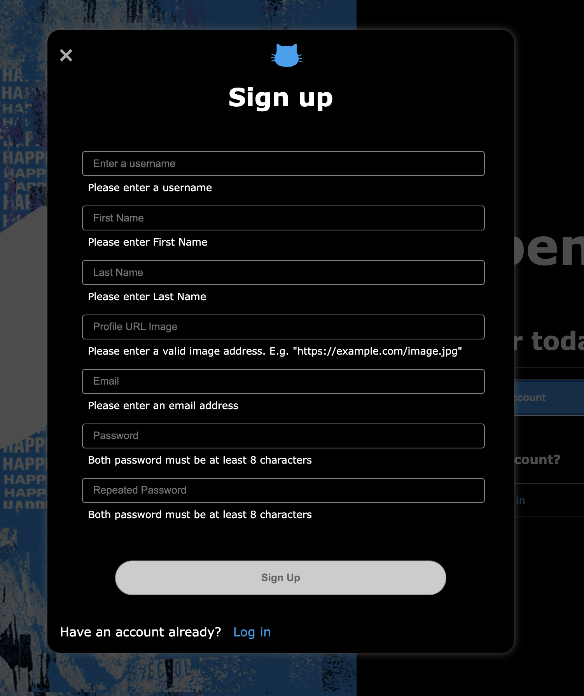
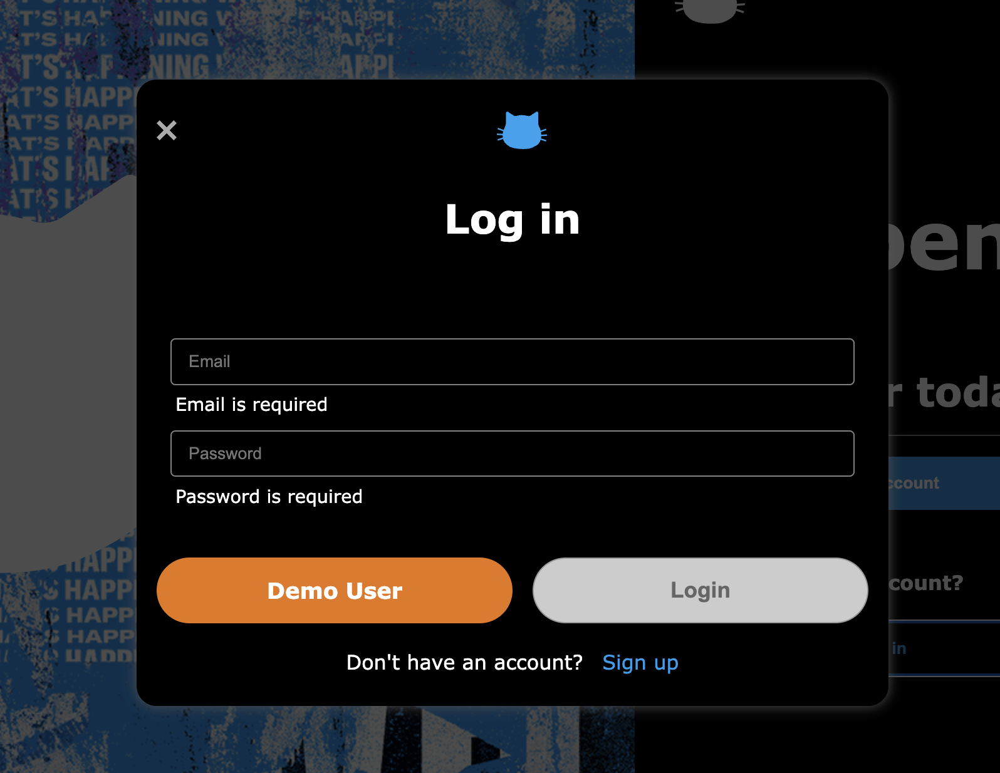
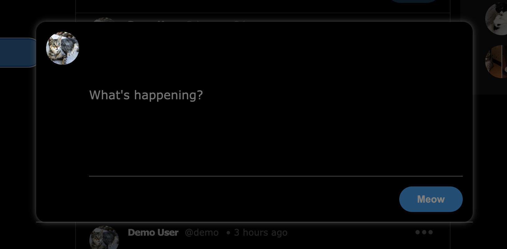
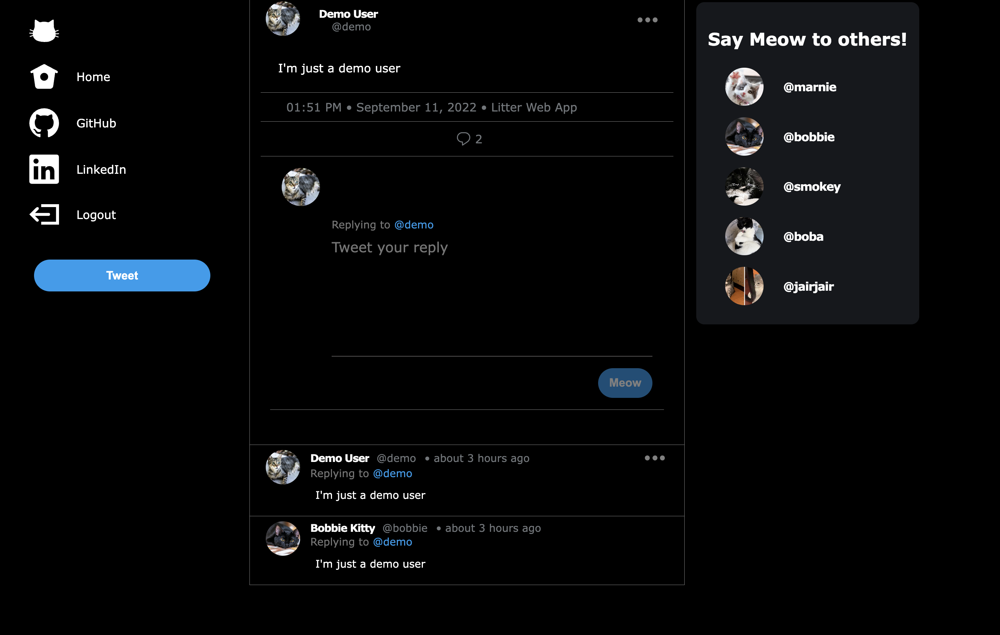
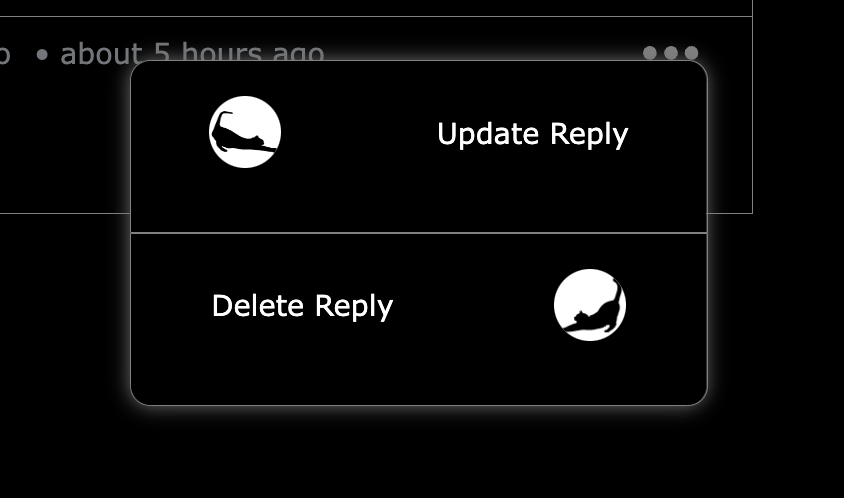
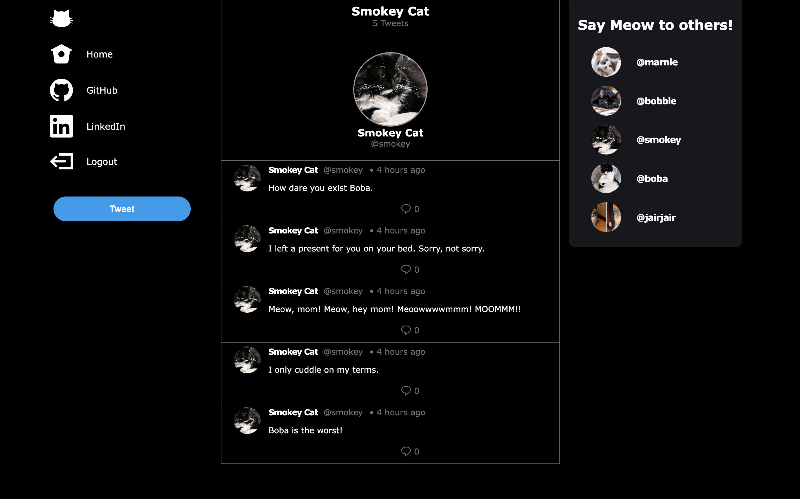

# Litter

Welcome to Litter! Litter is a pixel perfect social media clone of [Twitter](https://twitter.com/) made specially for cats (No dogs allowed)! Users can create a profile and tweet what's on their mind and also reply to other tweets! A user will also be able to view their profile or other users profile, which will display current profiles tweets. Users also have the option to update and delete their own tweets.

Checkout the live site here: [Litter](https://litter-twitter.herokuapp.com/)


### Languages
 

### Backend
  

### Hosting
 


## Wiki Links:

- [API Doctumentation](https://github.com/Jaircarbajal91/litter-twitter/wiki/API-Documentation)
- [DB Schema](https://github.com/Jaircarbajal91/litter-twitter/wiki/DB-Schema)
- [Features List](https://github.com/Jaircarbajal91/litter-twitter/wiki/Features)
- [User Stories](https://github.com/Jaircarbajal91/litter-twitter/wiki/User-Stories)
- [WireFrames](https://github.com/Jaircarbajal91/litter-twitter/wiki/Wireframes)

## Landing page


## Sign up Form


## Sign in Form


## Home Page


## New Tweet Modal


## Single Tweet / Reply Form


## Update Pop Up


## Current Profile


## Steps to clone locally:
1. Clone this repository:
```bash
git clone https://github.com/Jaircarbajal91/litter-twitter.git
```

2. Install backend dependencies:

```bash
pipenv install -r requirements.txt
```

3. Create a `.env` file based on the example with proper settings for development environment:
```
SECRET_KEY=INSERT_SECRET_KEY_HERE
DATABASE_URL=sqlite:///dev.db
```

4. Start pipenv, migrate database, seed database, and run Flask app:

```bash
pipenv shell
flask db upgrade
flask seed all
flask run
```

5. Install frontend dependencies:

```bash
cd react-app/
npm install
npm start
```


## Future Improvements/Goals:
- Add media queries to make UI dynamic for all screen sizes
- Implement Likes, Retweet, and Followers features
- Allow the site to post and view images, which would require AWS implementation
- Make home tweets display only tweets that the user is following.
